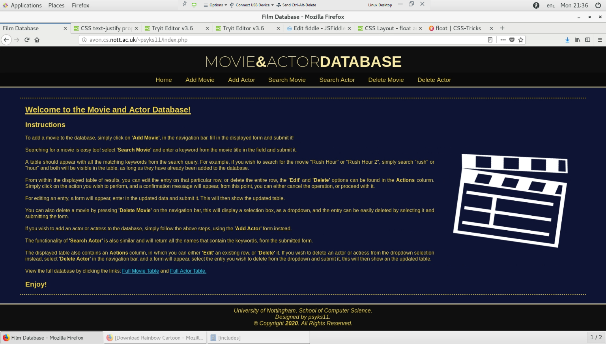

# Features List

Below is a list of HTML, CSS, JavaScript, PHP, and SQL features that I used in my code.

## HTML

| Features | Explanation |
|----------|-------------|
| `<p>` | This is the paragraph tag; it is used for basic text on the webpages. |
| `<a>` | This is the anchor tag; it can be used for hrefs as well as other things. |
| `<ul>` | This is the unordered list tag; it is used to declare an unordered list. |
| `<li>` | This is the list element tag; it is used to place each list element inside the unordered list. |
| `` | The img tag is used to link to an image and display it in the webpage. |
| `<form>` | The form tag is used to declare a form. |
| `<input>` | The input tag was used to declare some form elements, in this case fields for text, numbers, and a submit button. |
| `<select>` with `<option>` | The select tag was used to declare a selection field within the form in which options can be placed using the option tag. |
| `<head>` | The head tag was used to declare the head of the website. |
| `<body>` | The body tag was used to declare the body of the page. |
| `<title>` | The title tag was used to give a title to the website. |
| `<table>` | The table tag was used to declare a table. |
| `<th>`, `<tr>`, `<td>` | The th tag is the header for the table, the tr tag is declaring each row of the table, the td tag is declaring each cell of the table per row. |
| `<section>` | The section tag was used to declare a section of the webpage, similar to div. |
| `<div>` | The div tag was used to declare a division on the webpage, similar to section. |
| `<header>` | The header tag was used to declare a header for my webpages. |
| `<footer>` | The footer tag was used to declare a footer for my webpages. |
| `<link src="">` | The link tag with src is used to link to external files, in this case, CSS. |
| `<script src="">` | The script tag with src is used to link an external JavaScript file. |

## CSS - All CSS styling was done and stored externally to the main HTML code.

| Features | Example | Explanation |
|----------|---------|-------------|
| Style by element | `p { style here }` | Used to style tags on their own. |
| Style by class | `.class { style here }` | Used to style elements by their class. |
| Style by id | `#id { style here }` | Used to style elements by their id. |
| Style by pseudo class | `.class:hover { style here }` | Used to style a pseudo class within another element or class. |
| Style by sub element/attribute | `.class p { style here }` | Used to style something within something else. |

## JAVASCRIPT - All JavaScript functions were written and stored externally to the main HTML code.

| Features/Functions | Explanation |
|--------------------|-------------|
| Var | Used to declare a variable. |
| `Document.getElementById` | Used to get the HTML element by its id when passed to the function. |
| Form object | The form object can be used to parse data from a form for tasks such as validation (e.g., length and value can be compared against a string when `trim()` is used to check empty fields or compared against regular expressions to check for illegal characters). |
| Style object | The style object can be used to change the CSS styling of an object when an event occurs (e.g., to hide and show a section of the webpage based on id using the display as `block` or `none`). |
| Confirm | Displays a confirmation message when called and returns false when cancel is pressed or returns true when OK is pressed. |
| Alert | Simply displays an alert message when called. |

## PHP

| Features | Explanation |
|----------|-------------|
| `Errno` | Check for an error in connection. |
| `Die` | Used to output after an error. |
| `Execute` | Executes the SQL statement after preparation. |
| `Bind_result` | Binds the results to variable names before being fetched. |
| `Fetch` | Fetches the data from the database after execution. |
| `Close` | Closes the connection of the statement or to the database. |
| `Echo` | Echo is used as a means of printing HTML code out to the script. |
| `Htmlentities` | This function puts a variable in the right format to be displayed on the webpage properly. |
| `Urlencode` | This puts the variable in the correct format to be used in the URL. |

## SQL

| Features | Explanation |
|----------|-------------|
| `INSERT` | The SQL statement used to insert data into the database. |
| `SELECT` | The SQL statement used to search for data within the database. |
| `UPDATE` | The SQL statement used to update particular rows of data within the database. |
| `DELETE` | The SQL statement used to delete particular rows of data from the database. |

## Appendix

Below can be seen the index page for my website, which is capable of all the four main tasks of data manipulation, including Creating, Reading, Updating, and Deleting data to and from a database.

  

Below can be seen all the files used in a directory tree.

```
public_html
├── actAdd.php
├── actDelete.php
├── actEdit.php
├── actSearch.php
├── includes
│   ├── aTable.php
│   ├── db.php
│   ├── film.png
│   ├── footer.php
│   ├── forms.php
│   ├── head.php
│   ├── header.php
│   └── mTable.php
├── index.php
├── main.js
├── mvAdd.php
├── mvDelete.php
├── mvEdit.php
├── mvSearch.php
└── style.css
```
